# Graduation project

# 1- Wazuh Overview

**Wazuh** is an open-source security platform that provides unified **XDR and SIEM protection** for endpoints and cloud workloads.

---

# 2- Wazuh Capabilities

## Endpoint Security

- Configuration Assessment
- Malware Detection
- File Integrity Monitoring

## Threat Intelligence

- Threat Hunting
- Log Data Analysis
- Vulnerability Detection

## Security Operations

- Incident Response
- Regulatory Compliance
- IT Hygiene

## Cloud Security

- Container Security
- Posture Management
- Workload Protection

---

# 3- Wazuh Architecture

Wazuh consists of several central components that work together to collect, analyze, store, and visualize security data.

## 3.1 Architecture Overview

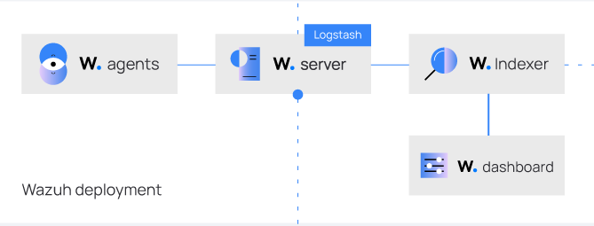

- **Agents** collect logs and security events from endpoints.
- **Server** analyzes the collected data and generates alerts.
- **Indexer** stores and organizes the alerts for fast searching.
- **Dashboard** allows analysts to view and investigate security events.

---

## 3.2 Wazuh Server

The **Wazuh server** is the main component responsible for processing and analyzing the data sent by Wazuh agents.

It performs several tasks such as:

- Analyzing logs and security events
- Applying detection rules and threat intelligence
- Generating security alerts
- Managing and configuring agents remotely

A single Wazuh server can handle data from **thousands of agents**, and it can be scaled using clustering if needed.

---

## 3.3 Wazuh Indexer

The **Wazuh indexer** is responsible for storing and indexing the security data generated by the Wazuh server.

Its main role is to:

- Store alerts and event data
- Index data to allow fast searching
- Support data analysis and querying

The indexer is built on **OpenSearch**, which allows it to handle large amounts of data efficiently.

---

## 3.4 Wazuh Dashboard

The **Wazuh dashboard** is the web interface used to interact with the Wazuh platform.

Through the dashboard, analysts can:

- View and investigate security alerts
- Analyze logs and events
- Monitor vulnerabilities and system integrity
- Check compliance and security posture

It provides a centralized view that helps security teams monitor and manage their environment.

---

# 4- Deployment Steps

## 4.1 Install Ubuntu Desktop 22.04.5 on VMware

Set up a new virtual machine using **VMware Workstation** and install **Ubuntu Desktop 22.04.5 LTS**.

## 4.2 Install Wazuh Manager on Ubuntu

### 4.2.1 Requirements

### Hardware

Hardware requirements depend on the number of endpoints and workloads monitored.

| Agents | CPU | RAM | Storage (90 days) |
| --- | --- | --- | --- |
| 1–25 | 4 vCPU | 8 GB | 50 GB |
| 25–50 | 8 vCPU | 8 GB | 100 GB |
| 50–100 | 8 vCPU | 8 GB | 200 GB |

### Operating System

Supported operating systems include:

- Amazon Linux 2 / 2023
- CentOS Stream 10
- RHEL 7 / 8 / 9 / 10
- Ubuntu 16.04 / 18.04 / 20.04 / 22.04 / 24.04

---

### 4.2.2 Deployment

1. Download and run the Wazuh installation assistant.
    
    ```coffeescript
    curl -sO https://packages.wazuh.com/4.14/wazuh-install.sh && sudo bash ./wazuh-install.sh -a
    ```
    
    Once the assistant finishes the installation, the output shows the access credentials and a message that confirms that the installation was successful.
    
    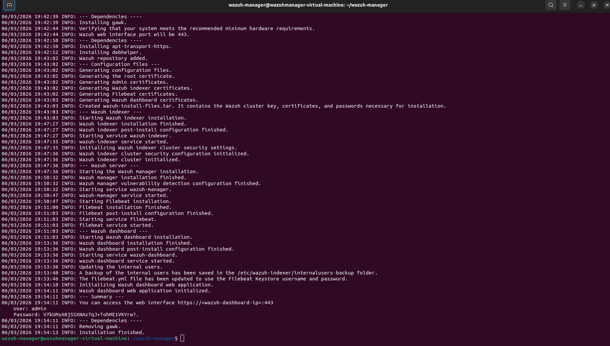
    
    - You now have installed and configured Wazuh.
2. Access the Wazuh web interface with `https://<WAZUH_DASHBOARD_IP_ADDRESS>` and your credentials:
    - **Username**: `admin`
    - **Password**: `<ADMIN_PASSWORD>`

---

**Required Ports for Wazuh Communication**

| Port | Used By | Purpose |
| --- | --- | --- |
| **443** | Wazuh Dashboard | Provides secure web access to the Wazuh dashboard interface. |
| **1514** | Wazuh Server | Used by Wazuh agents to send security events and logs to the server. |
| **1515** | Wazuh Server | Used for agent registration and authentication with the Wazuh manager. |
| **55000** | Wazuh API | Provides access to the Wazuh RESTful API used by the dashboard and integrations. |
| **514** | Syslog | Used to receive syslog messages from external devices such as routers, firewalls, and servers. |
| **9200** | Wazuh Indexer | Used for communication with the indexer to store and query indexed alert data. |
1. Apply firewall rules on ubuntu to allow connection to the following ports 
    
    ```bash
    sudo su 
    ufw enable
    ufw allow 443/tcp 
    ufw allow 1514/tcp
    ufw allow 1515/tcp
    ufw allow 55000/tcp
    ufw allow 514/tcp
    ufw allow 9200/tcp
    ```
    
- Verify the rules is added using  `sudo ufw status`

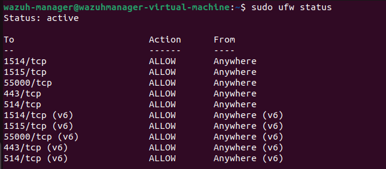

---

# 5- Verification

### 5.1 Check Wazuh Services

```bash
sudo systemctl status wazuh-manager
sudo systemctl status wazuh-indexer
sudo systemctl status wazuh-dashboard
```

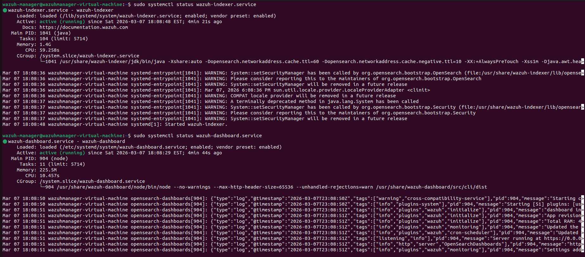

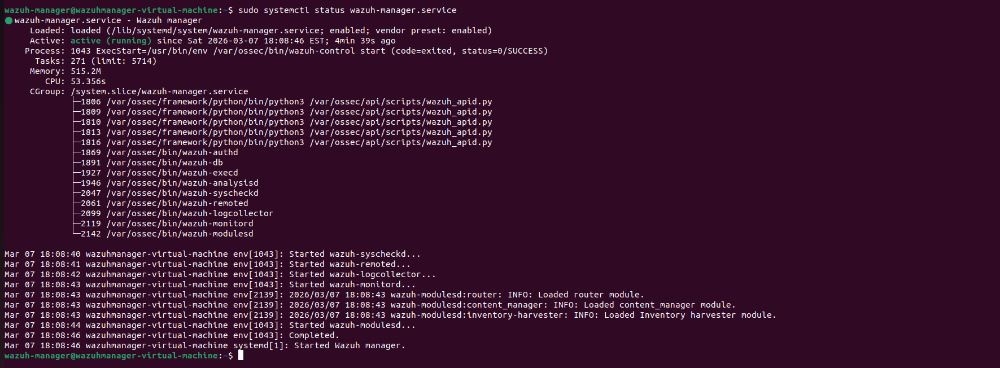

---

### 5.2 Access Wazuh Dashboard

Open the dashboard using:

`https://<ubuntu_server_IP>`

**Dashboard Interface**

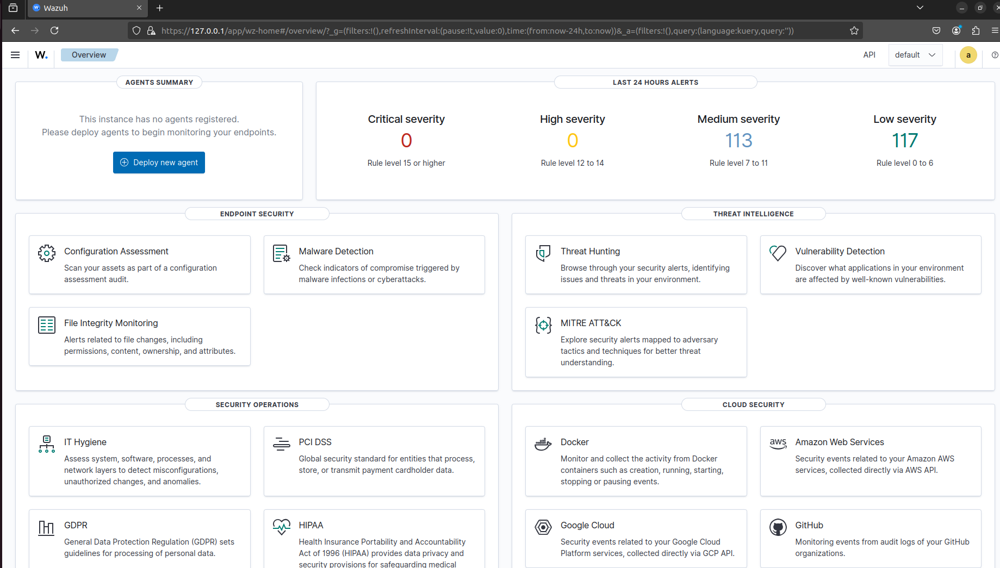

---

# 6- Wazuh Agent Deployment

### 6.1 Install Sysmon logging service

**Sysmon:**  is a Windows system monitoring tool developed by Microsoft as part of the Sysinternals suite. It runs as a background service and logs detailed information about system activities such as process creation, network connections, file creation, and registry modifications. Sysmon records these events in the Windows Event Log, allowing security analysts and monitoring systems to detect suspicious behavior, investigate incidents, and improve threat detection and response within enterprise environments.

### 6.1.1 Sysmon Installation Steps

- download URL : [https://learn.microsoft.com/en-us/sysinternals/downloads/sysmon](https://learn.microsoft.com/en-us/sysinternals/downloads/sysmon)
- sysmon moduler file : [https://github.com/olafhartong/sysmon-modular](https://github.com/olafhartong/sysmon-modular)

 

**Importance of the Sysmon-Modular Configuration File**

- The **Sysmon-Modular configuration file** is an advanced configuration approach used with Sysmon to manage monitoring rules in a structured and scalable way. Instead of using a single large configuration file, the modular approach organizes Sysmon rules into multiple smaller modules, each responsible for monitoring a specific type of system activity such as process creation, network connections, file operations, or registry modifications.
- This modular structure improves maintainability and flexibility by allowing security teams to easily update, add, or remove specific monitoring rules without modifying the entire configuration. It also helps reduce unnecessary log noise by enabling precise filtering of events, ensuring that only relevant security activities are recorded. As a result, analysts can more efficiently detect suspicious behavior and investigate incidents when integrating Sysmon logs with security monitoring platforms such as Wazuh, Splunk, or Elastic Stack.

---

- **open powershell as administrator  :**

```powershell
.\Sysmon64.exe -accepteula -i .\sysmonconfig.xml
```

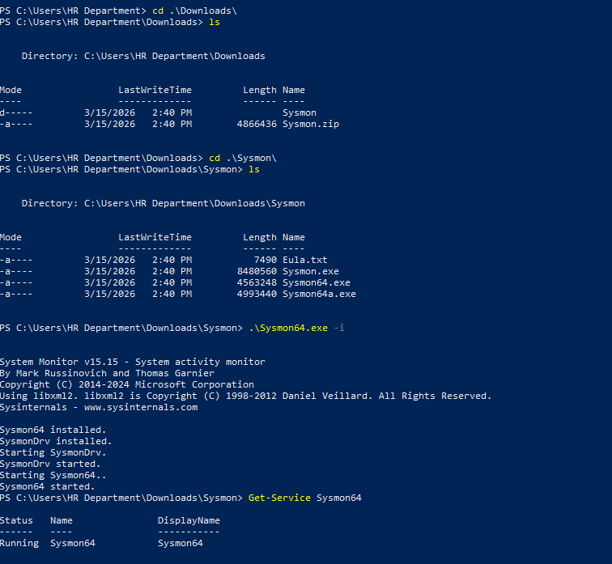

*now Sysmon logging service has been installed successfully* 

---

### 6.2 Deploy Wazuh Agent

1. **Select the Operating System**
    - We start by choosing the target OS for the agent. In this case, the agent is deployed on a **Windows** platform.
2. **Configure Wazuh Manager Connection**
    - Set the static IP of the Wazuh Manager server: `192.168.159.142`
    - This ensures the agent communicates consistently with the manager.
3. **Assign Agent Name**
    - Give the agent a descriptive name that clearly identifies the endpoint.
    - Example: `windows-HR-manager` to easily recognize the host in the Wazuh Dashboard.
        
        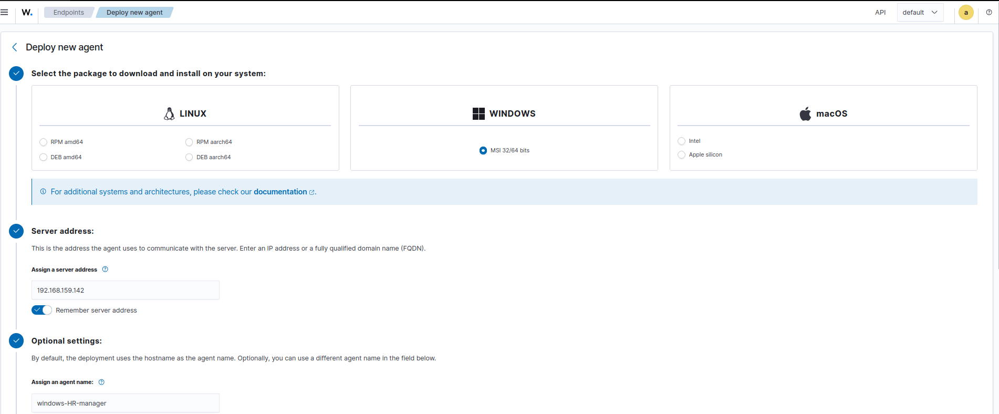
        
4. Copy the given command and go to windows endpoint and open powershell as **administrator**
5. **Verify Deployment**
    - After installation, check that the agent service is running and connected to the manager.
    
    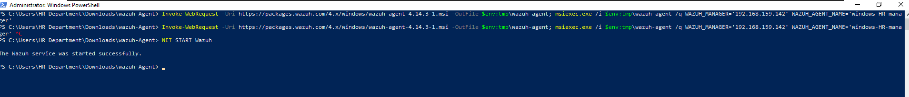
    
    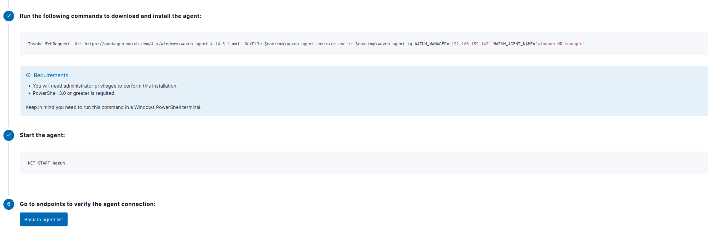
    
    Now the agent is installed successfully . 
    

---

here the agent start collect metadata of endpoint and send it to wazuh manager 

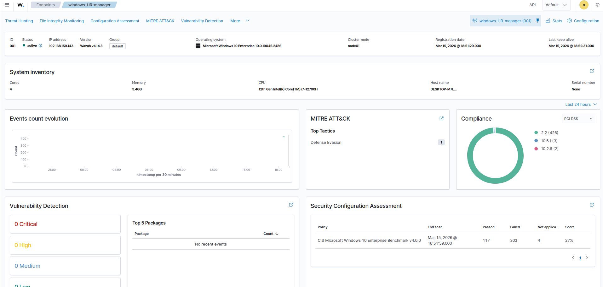

---

We now Go to **Discover page** to see if agent send logs successfully or not 


as we see here the logs is delivered and arrived to Wazuh SIEM correctly

---

### IT Hygiene Monitoring

Maintaining good **IT hygiene** ensures that endpoints are secure, properly configured, and free of unnecessary software or vulnerabilities. Using **Wazuh**, we can monitor and assess the health of our Windows endpoints effectively.

---

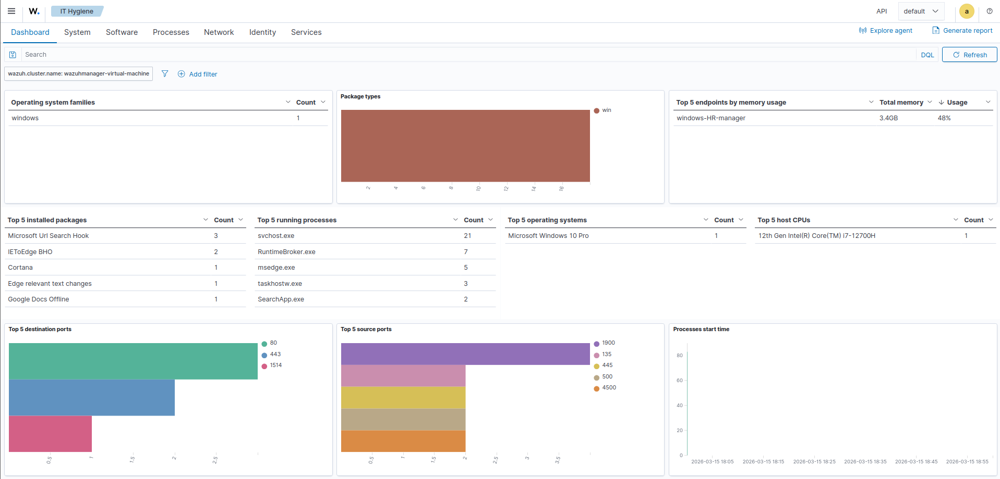

From the **dashboard** above:

- **Operating System**: Identifies the OS family and version, helping to ensure all systems are up-to-date and compliant.
- **Installed Packages & Applications**: Lists the top applications, which assists in detecting unauthorized or outdated software.
- **Running Processes**: Monitoring active processes can detect suspicious activity or unnecessary resource usage.
- **Memory & CPU Usage**: Tracks system resource consumption to identify endpoints under stress or potentially compromised.
- **Network Ports**: Both source and destination ports are monitored to ensure only legitimate traffic is active, helping detect potential vulnerabilities.
- **System Inventory**: Provides a complete snapshot of software, processes, users, and hardware configurations, which supports compliance and security audits.

By continuously monitoring these metrics, IT teams can:

1. Detect misconfigurations or unauthorized software installations.
2. Ensure endpoints comply with security policies.
3. Reduce the attack surface by removing unused services or applications.
4. Track system health and prevent downtime or performance issues.

This approach to IT hygiene ensures **proactive endpoint security** and strengthens the overall cybersecurity posture of the organization.

---

# 7- Set Up Wazuh Alerts on Slack


- URL for Slack :  [https://slack.com/](https://slack.com/)

#### **7.1**  We create first Slack workspace and named it `Wazuh-Alerts`


#### 7.2 Add Coworkers in **Soc** Team to the Channel to can Monitor the alerts Also .

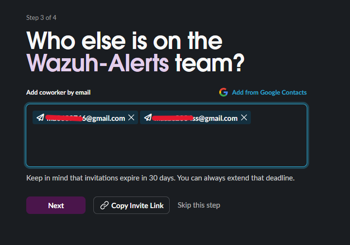

#### 7.3 Create a three channels with Slack Workcspace and their webhooks:

- `critical`
- `high`
- `medium`
- `low`


#### 7.4 Create Webhook for each channel

- Go to [https://api.slack.com/apps](https://api.slack.com/apps)
- click on the create app and select **Wazuh-Alerts** as workspalce
- in the popup select the `From a mainfest`
- set the notification name as `wazuh_notifications`


- then click next
- from the **slack api** page go to , `incomming Webhooks` and enable it


- now create the four webhook for the three channels from **`add new webhook`** button :

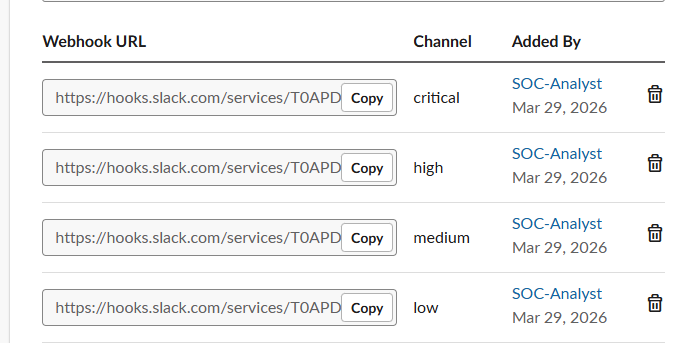

---

### 7.5 creating a custom integration script to send Wazuh alerts directly to Slack channels

#### **Step 1: Set up Python Virtual Environment in Wazuh**

Create a Python virtual environment inside the Wazuh directory (`/var/ossec`) to avoid permission issues and package conflicts.

```coffeescript
# swith to root first
mkdir -p /var/ossec/venv
sudo apt install python3-venv
sudo apt install python3
python3 -m venv /var/ossec/venv
cd /var/ossec/venv/bin/activate
source /var/ossec/venv/bin/activate
pip install requests  
```

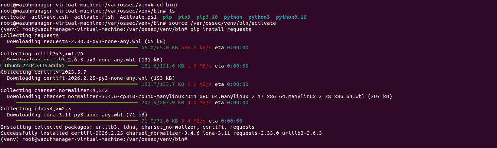

#### **Step 2: Create Slack Integration Script**

- Name the script with prefix `custom-`.
- **Location:** `/var/ossec/integrations/custom-slack.py`
- script file is here [https://github.com/MOHAMED-MAHM0UD/wazuh-home-lab/tree/main/slack-script](https://github.com/MOHAMED-MAHM0UD/wazuh-home-lab/tree/main/slack-script)
- and in the top of file put the webhook URL for each channel from slack api

#### **Step 3: Create Shell Wrapper Script**

Wazuh calls shell scripts, so create a simple wrapper to call the Python script. It should have the same name of the python file without the `.py` extension. **Location:** `/var/ossec/integrations/custom-slack` 

```coffeescript
#!/bin/sh

# Set the virtual environment Python binary
CUSTOM_PYTHON="/var/ossec/venv/bin/python3"

SCRIPT_PATH_NAME="$0"
DIR_NAME="$(cd "$(dirname "${SCRIPT_PATH_NAME}")"; pwd -P)"
SCRIPT_NAME="$(basename "${SCRIPT_PATH_NAME}")"
PYTHON_SCRIPT="${DIR_NAME}/${SCRIPT_NAME}.py"

# Run the integration script using custom Python interpreter
${CUSTOM_PYTHON} "${PYTHON_SCRIPT}" "$@"
```

Make both scripts executable and set proper ownership:

```coffeescript
chmod 750 /var/ossec/integrations/custom-slack*
chown root:wazuh /var/ossec/integrations/custom-slack*
```

---

#### **Step 4: Configure Integration in `ossec.conf`**

- Ensure that `logall_json` is enabled by setting it to `yes` in your `ossec.conf` file:

```coffeescript
<ossec_config>
  <global>
    <jsonout_output>yes</jsonout_output>
    <alerts_log>yes</alerts_log>
    <logall>yes</logall>
    <logall_json>yes</logall_json>
  </global>
</ossec_config>
```

- Add the integration block in `/var/ossec/etc/ossec.conf`:
- The `<name>` tag value (`custom-slack`) must exactly match the name of your wrapper script.

```coffeescript
<ossec_config>
    <integration>
    <name>custom-slack</name>
    <alert_format>json</alert_format>
    </integration>
</ossec_config>
```

**Restart Wazuh to apply changes:**

```coffeescript
systemctl restart wazuh-manager.service
```

#### **Step 6: Test the Integration**

Test manually with an alert JSON file:

```coffeescript
/var/ossec/integrations/custom-slack /var/ossec/logs/alerts/alerts.json
```

- You’ll begin receiving real-time Slack alerts for all critical, high, and medium-level events. Each alert is detailed, well-formatted, and clearly marked by severity, helping you respond faster and more effectively.
- Alert from medium channel

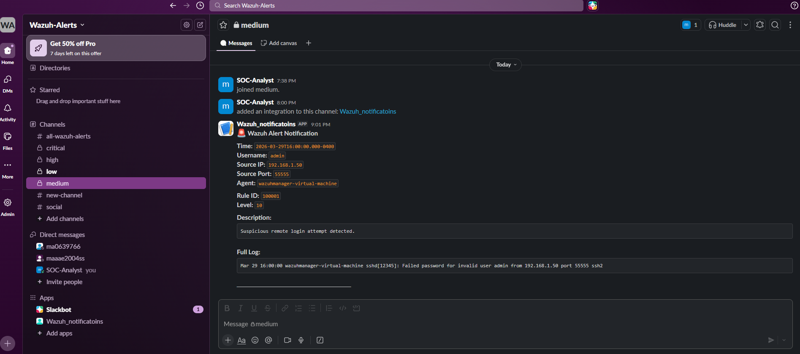

- Alert from **low channel**


---

# 7- Enable Active Response

In Wazuh, "Auto Response" is officially called **Active Response**. It is a powerful feature that allows the Wazuh Manager to automatically run scripts or commands on your endpoints (Agents) when a specific alert or threat level is triggered.

A perfect use case for a defensive setup is automatically blocking an IP address that is trying to brute-force your system.

Here is exactly how to enable and configure an Active Response, using the built-in `firewall-drop` script as a practical example.

### Step 1: Whitelist Your Own IP (Critical)

Before you enable Active Response, you **must** whitelist your own IP address (and your Wazuh Manager's IP). **If you don't do this, you might accidentally lock yourself out of your own lab!**

1. On your **Wazuh Manager** (your Ubuntu VM), open the main configuration file
    
    ```bash
    sudo nano /var/ossec/etc/ossec.conf
    ```
    
2. Look for the `<global>` section.
3. Add your physical machine's IP address and the Wazuh Manager's IP to the `<white_list>` tags:XML
    
    ```xml
    <global>
      <white_list>127.0.0.1</white_list>
      <white_list>^localhost.localdomain$</white_list>
      <white_list>192.168.1.12</white_list> <white_list>192.168.1.X</white_list>  </global>
    ```
    

---

### Step 2: Define the Command

Wazuh needs to know *what* script to run. Wazuh comes with several built-in scripts (like `firewall-drop`, `restart-ossec`, `disable-account`).

1. Scroll down in the same `/var/ossec/etc/ossec.conf` file until you find the `<command>` sections.
2. The `firewall-drop` command is usually already defined by default. Verify it looks like this:
    
    ```xml
    <command>
      <name>firewall-drop</name>
      <executable>firewall-drop</executable>
      <timeout_allowed>yes</timeout_allowed>
    </command>
    ```
    

---

### Step 3: Link the Command to an Alert (The Trigger)

Now you need to tell Wazuh *when* to trigger that command. For example, let's say we want to drop the connection if someone triggers Rule **`*5712` (SSH brute-force attempt).***

1. Still in `/var/ossec/etc/ossec.conf`, scroll down to the `<active-response>` section.
2. Add a new block like this:
    
    ```xml
    <active-response>
      <command>firewall-drop</command>
      <location>local</location>
      <rules_id>5712</rules_id>
      <timeout>600</timeout>
    </active-response>
    ```
    
    **What this means:**
    
    - `<location>local</location>`: Run the block only on the specific Agent that detected the attack.
    - `<rules_id>5712</rules_id>`: Trigger this response when rule 5712 fires. You could also use `<level>10</level>` to trigger on *any* alert level 10 or higher.
    - `<timeout>0</timeout>`: Lift the ban after 600 seconds (10 minutes).
3. Save the file (`Ctrl+O`, `Enter`, `Ctrl+X`).

---

### Step 4: Apply the Changes

For the Manager to read these new rules, you must **restart** the Wazuh Manager service:

```bash
sudo systemctl restart wazuh-manager
```

### How to Test It

To see if it works without actually attacking your network, you can trigger a fake alert on your endpoint. If you configured it for SSH brute-force (Rule 5712), you can try logging into an SSH server with the wrong password 5 or 6 times.

You can then check the Active Response logs on the endpoint to see the action being taken. The logs for Active Response actions are stored here on the Agents:

- **Linux:** `/var/ossec/logs/active-responses.log`
- **Windows:** `C:\Program Files (x86)\ossec-agent\active-response\active-responses.log`

---

# 8- Enable FIM on windows from wazuh server

> ***Instead of editing the local `ossec.conf` on the endpoint, you edit a file called `agent.conf` on the Manager, and the Manager automatically pushes the settings to all the connected agents.***
> 

Here is exactly how to set up that Temp folder FIM rule centrally from your Ubuntu Manager:

### Step 1: Open the Shared Configuration File

Wazuh groups agents together to push settings. By default, all new agents are put in the `default` group.

1. Open your terminal on the **Wazuh Manager** (Ubuntu).
2. Open the shared configuration file for the default group:Bash
    
    `sudo nano /var/ossec/etc/shared/default/agent.conf`
    

### Step 2: Add the Windows-Specific Rule

Because your network might have both Linux and Windows machines, you cannot just push a `C:\` drive rule to everyone (it would cause errors on Linux). You must wrap the rule in a tag that tells Wazuh to **only apply this to Windows agents**.

Add the following block into the file (if the file is empty, just paste this in):

```xml
<agent_config os="Windows">
  <syscheck>
    <directories realtime="yes" restrict=".exe|.vbs|.ps1|.bat|.cmd|.dll">C:\Windows\Temp</directories>
    <directories realtime="yes" restrict=".exe|.vbs|.ps1|.bat|.cmd|.dll">C:\Users\*\AppData\Local\Temp</directories>
  </syscheck>
</agent_config>
```

Save the file (`Ctrl+O`, `Enter`, `Ctrl+X`).

### Step 3: Verify the Syntax and Restart

Before pushing the new config, it is a good habit to check if the XML is written correctly so it doesn't break the agents.

1. Run the verification tool
    
    ```bash
    sudo /var/ossec/bin/verify-agent-conf
    ```
    
    *(If it returns nothing or says "OK", your syntax is perfect).*
    
2. Restart the Manager to immediately trigger the push
    
    ```bash
    sudo systemctl restart wazuh-manager
    ```
    

Within a few minutes, the Wazuh Manager will securely send this `agent.conf` file to all Windows agents. The agent will download it, store it in its local `shared` folder, and automatically merge these rules with its local settings on the fly.

If you ever want to add more paths to monitor, or change the extensions, you just update this one file on the Manager, and the whole fleet updates **automatically**!

---

# 9- Enable FIM from Windows agent

Monitoring the temporary directories is an excellent defensive strategy. Malware droppers and script-based payloads almost always use `C:\Windows\Temp` or the user's `AppData\Local\Temp` folder as a staging ground before executing.

In Wazuh, the FIM module is called **Syscheck**. Because temporary folders constantly create and delete benign files, monitoring them can generate massive log noise and slow down the endpoint. To build a robust, production-ready defense, 

we will enable FIM but **restrict** it to only alert on suspicious file types (like executables and scripts).

**Here is how to configure it directly on your Windows endpoint:**

### Step 1: Open the Agent Configuration

1. On your Windows machine, open **Notepad as an Administrator**.
2. Go to **File > Open**, navigate to `C:\Program Files (x86)\ossec-agent\`, and change the file type drop-down (bottom right) from "Text Documents" to "All Files".
3. Open **`ossec.conf`**.

### Step 2: Add the FIM Directory Rule

1. Inside the file, search for the `<syscheck>` block. (This section controls all File Integrity Monitoring).
2. Scroll down a bit until you see the list of default `<directories>` tags.
3. Add the following lines to monitor both the system Temp folder and the global Users Temp folders in real-time, restricted to dangerous extensions:

```xml
    <directories realtime="yes" restrict=".exe|.vbs|.ps1|.bat|.cmd|.dll">C:\Windows\Temp</directories>
    <directories realtime="yes" restrict=".exe|.vbs|.ps1|.bat|.cmd|.dll">C:\Users\*\AppData\Local\Temp</directories>
```

**What this does:**

- `realtime="yes"`: Alerts the Manager immediately when a file is dropped, rather than waiting for the standard 12-hour scan cycle.
- `restrict="..."`: Tells the agent to ignore temporary `.tmp` or `.log` files created by normal Windows operations, drastically reducing noise and saving CPU power.

### Step 3: Restart the Agent

Save the file (`Ctrl+S`). Then, open PowerShell as an Administrator and restart the service so it reads the new rules:

PowerShell

```powershell
Restart-Service -Name WazuhSvc
```

### Step 4: Test Your Trap

To verify the configuration is working without running actual malware:

1. Open your `C:\Windows\Temp` folder.
2. Right-click > New > Text Document.
3. Rename it to `malware-test.exe` (make sure Windows is showing file extensions so it isn't named `malware-test.exe.txt`).
4. Go to your Wazuh Manager dashboard (on your Ubuntu VM), navigate to the **Integrity Monitoring** module, and check the events. Within a few seconds, you should see an alert popping up for a file creation event in the Temp directory!

---
